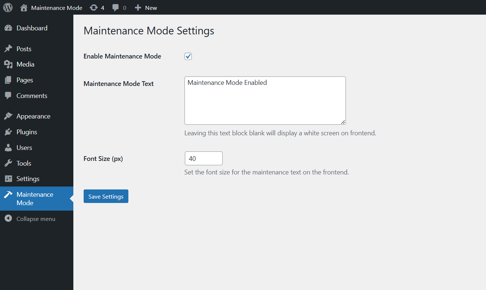

# Simple Maintenance Mode White Screen

Enable maintenance mode with a white screen or custom text displayed on the frontend.

## Description

Simple Maintenance Mode allows you to enable a maintenance mode on your WordPress site. When enabled, visitors will see a custom message or a white screen (if no text is entered). It includes a settings page where you can customize the maintenance mode message and font size.

## Features

- Enable/disable maintenance mode with a single checkbox
- Custom maintenance message text
- Configurable font size
- Logged-in users bypass maintenance mode
- Clean uninstall (removes all plugin data from the database)

## Requirements

- WordPress 5.2 or higher
- PHP 7.0 or higher

## Installation

1. Upload the plugin to the `/wp-content/plugins/` directory.
2. Activate the plugin through the **Plugins** menu in WordPress.
3. Go to the **Maintenance Mode** menu in the admin dashboard to configure the plugin settings.
4. Enable or disable maintenance mode and set your custom message.

## Screenshots

## Changelog

### 1.8
- Enhancement - Added admin bar indicator when maintenance mode is active with link to settings.
- Enhancement - Moved form processing to admin_init for proper Post/Redirect/Get pattern.
- Enhancement - Replaced query parameter with transient for settings saved notice.

### 1.7
- Fix - esc_html() replaced with esc_html__() for proper translation support on settings saved notice.

### 1.6
- Fix - Inconsistent default font size across plugin files.

### 1.5
- Added uninstall.php for clean database cleanup when plugin is deleted.

### 1.4
- Author name updated.

### 1.3
- Author URL updated.
- Tested up to 6.9

### 1.2
- Fix - Maintenance mode page title updated to use site title.
- Tested up to 6.8

### 1.1
- Updates after initial review.
- Enhancement - Readme.txt update.
- Fix - Functions/Variables name prefixes updated.

### 1.0
- Initial release of the plugin.

## License

This plugin is licensed under the [GPL-2.0+](https://www.gnu.org/licenses/gpl-2.0.html) License.
